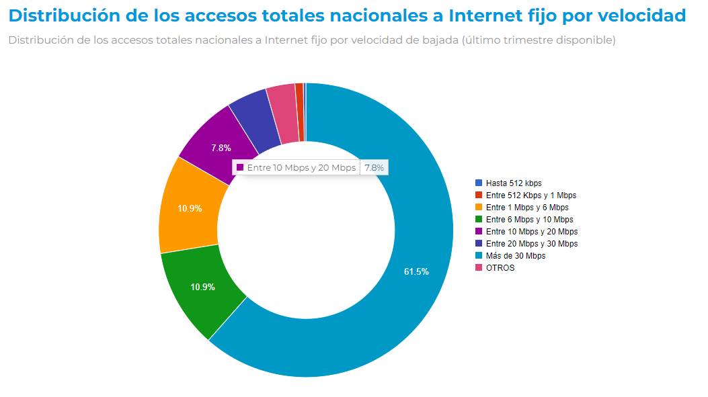
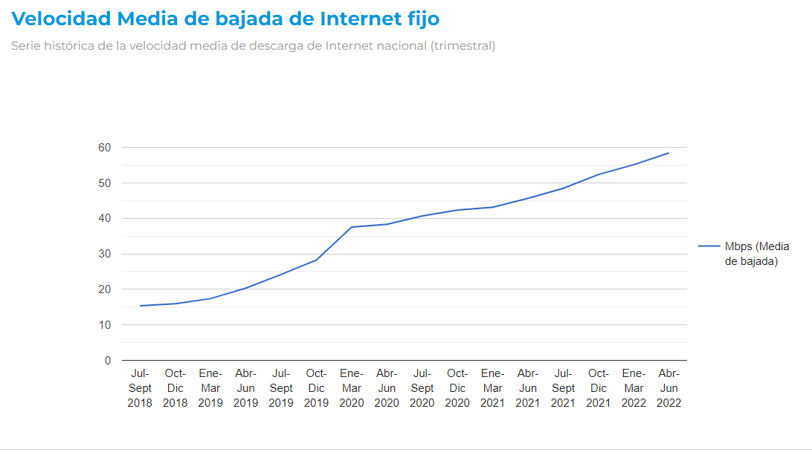

## Analisis de las Telecomunicaciones
 Proyecto 2 Henry

### Contexto

La industria de las telecomunicaciones ha jugado un papel vital en nuestra sociedad, facilitando la información a escala internacional y permitiendo la comunicación continua incluso en medio de una pandemia mundial. La transferencia de datos y comunicación se realiza en su mayoría a través de internet, líneas telefónicas fijas, telefonía móvil, casi en cualquier lugar del mundo.

En comparación con la media mundial, Argentina está a la vanguardia del desarrollo de las telecomunicaciones, teniendo para el 2023 un total de [79,12 millones conexiones](https://www.datosmundial.com/america/argentina/telecomunicacion.php).

### Rol a desarrollar

En este contexto, una empresa prestadora de servicios de telecomunicaciones me encarga la realización de un **análisis** completo que permita reconocer el comportamiento de este sector a nivel nacional. Se considera que la principal actividad de la empresa es brindar  **acceso a internet** , pero también es importante considerar el resto de los servicios.

---

### Fuente de datos

La información que se utilizó para este análisis fue obtenida de los datasets que se encuentran en el sitio oficial del [ENACOM](https://datosabiertos.enacom.gob.ar/dashboards/20000/acceso-a-internet/).

---

### Declaración de Objetivos

* Desarrollar un análisis para determinar la situación actualizada del Internet en la República Argentina.
* Crear un índice de medición para la calidad de acceso a Internet en la República Argentina.
* Ubicar en la comparación, cómo se encuentra la República Argentina en relación a la región.

---

### EDA - Análisis Exploratorio de Datos

Se realizó el análisis directamente en Python importando los datasets previamente descargados y haciendo un ETL de cada uno de ellos. Transformando los tipos de datos a los que se consideraron correctos.

---

### Creación y desarrollo de KPI's

Incremento al Acceso del 2%

Crecimiento del Internet

Aumento Trimestral de Ingresos del 10%

---

### Conclusiones

* Argentina, en comparación con la región, está a la vanguardia en el acceso a internet.
* Si bien la posición Argentina es muy buena, aún quedan aspectos por mejorar como las tecnologías y la velocidad.
* Se observaron inconvenientes en la continuidad del desarrollo de forma sostenida entre cambios de gobiernos.
